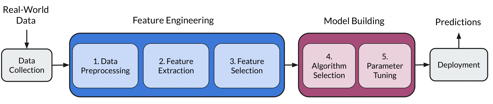
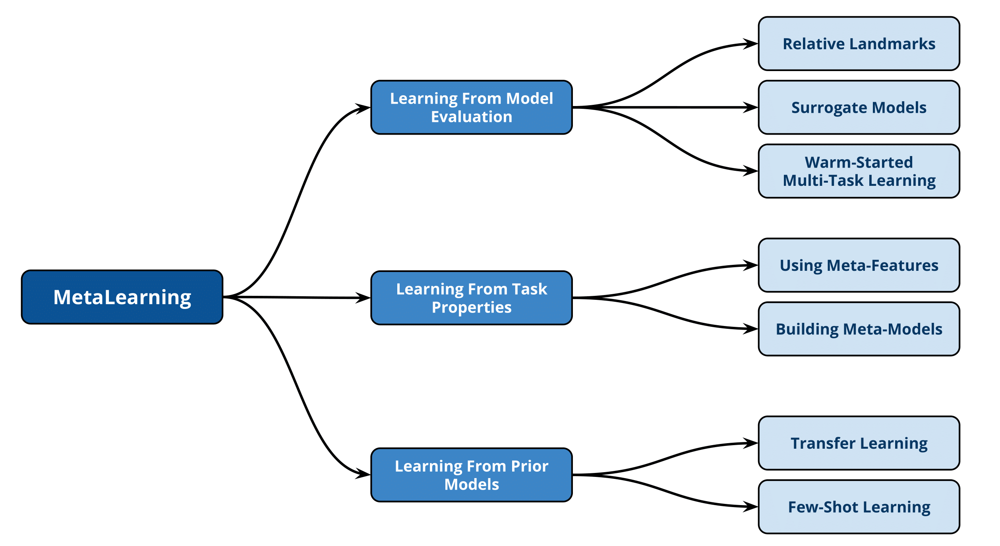
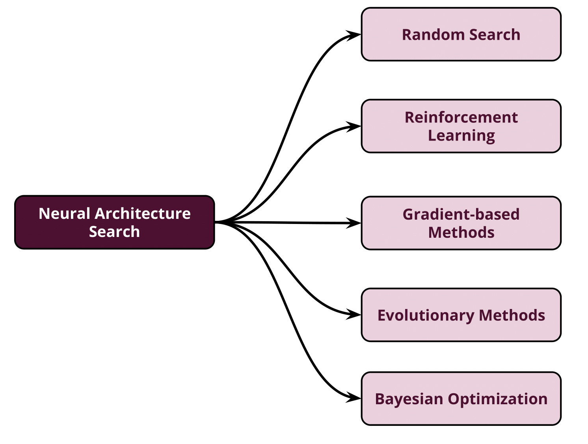
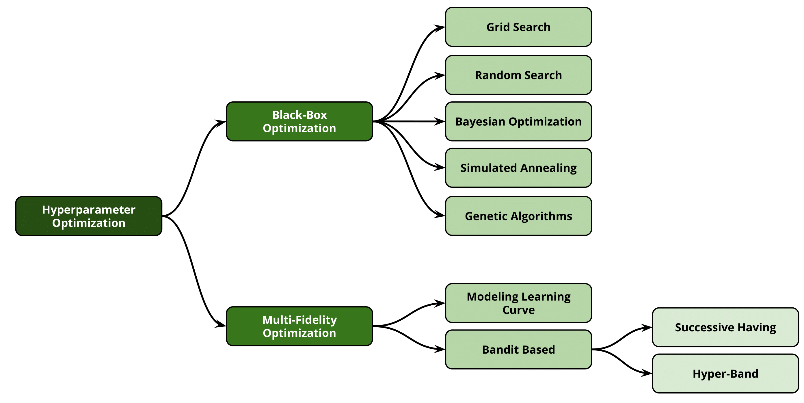
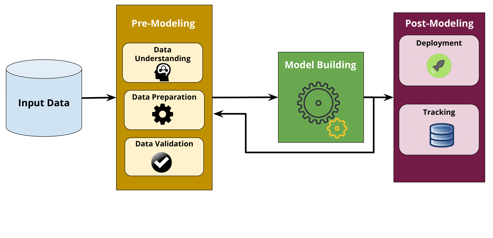
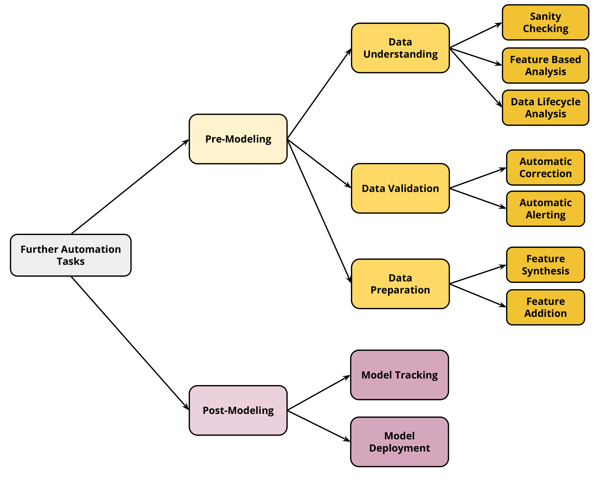

# Survey on End-To-End Machine Learning Automation

<div style="text-align: center">

</div>
In this repository, we present the references mentioned in a comprehensive survey for the state-of-the-art efforts in tackling the automation of Machine Learning  AutoML, wether through fully automation to the role of data scientist or using some aiding tools that minimize the role of human in the loop. First, we focus on the Combined Algorithm Selection, and Hyperparameter Tuning (CASH) problem. In addition, we highlight the research work of automating the other steps of the full complex machine learning pipeline from data understanding till model deployment. Furthermore, we provide a comprehensive coverage for the various tools and frameworks that have been introduced in this domain.

<hr>

## Table of Contents & Organization:
This repository will be organized into 5 separate sections:
+ [Meta-Learning Techniques for AutoML search problem](#meta-learning-techniques-for-automl-search-problem)
  - [Learning From Model Evaluation](#learning-from-model-evaluation)
    - [Surrogate Models](#surrogate-models)
    - [Warm-Started Multi-task Learning](#warm-started-multi-task-learning)
    - [Relative Landmarks](#relative-landmarks)
  - [Learning From Task Properties](#learning-from-task-properties)
    - [Using Meta-Features](#using-meta-features)
    - [Using Meta-Models](#using-meta-models)
  - [Learning From Prior Models](#learning-from-prior-models)
    - [Transfer Learning](#transfer-learning)
    - [Few-Shot Learning](#few-shot-learning)
+ [Neural Architecture Search Problem](#neural-architecture-search-problem)
  - [Random Search](#random-search)
  - [Reinforcement Learning](#reinforcement-learning)
  - [Evolutionary Methods](#evolutionary-methods)
  - [Gradient Based Methods](#gradient-based-methods)
  - [Bayesian Optimization](#bayesian-optimization)
+ [Hyper-Parameter Optimization](#hyper-parameter-optimization)
  - [Black Box Optimization](#black-box-optimization)
    - [Grid and Random Search](#grid-and-random-search)
    - [Bayesian Optimization](#bayesian-optimization)
    - [Simulated Annealing](#simulated-annealing)
    - [Genetic Algorithms](#genetic-algorithms)
  - [Multi-Fidelity Optimization](#multi-fidelity-optimization)
    - [Modeling Learning Curve](#modeling-learning-curve)
    - [Bandit Based](#bandit-based)
+ [AutoML Tools and Frameworks](#automl-tools-and-frameworks)
  - [Centralized Frameworks](#centralized-frameworks)
  - [Distributed Frameworks](#distributed-frameworks)
  - [Cloud-Based Frameworks](#cloud-based-frameworks)
  - [NAS Frameworks](#nas-frameworks)
+ [Pre-Modeling and Post-Modeling Aiding Tools](#pre-modeling-and-post-modeling-aiding-tools)
  - [Pre-Modeling](#pre-modeling)
    - [Data Understanding](#data-understanding)
    - [Data Validation](#data-validation)
    - [Data Preparation](#data-preparation)
  - [Post-Modeling](#post-modeling)

<hr>

## Meta-Learning Techniques for AutoML search problem:
Meta-learning can be described as the process of leaning from previous experience gained during applying various learning algorithms on different kinds of data, and hence reducing the needed time to learn new tasks.
  - 2018 | Meta-Learning: A Survey.  | Vanschoren | CoRR | [`PDF`](https://arxiv.org/abs/1810.03548)
  - 2008 | Metalearning: Applications to data mining | Brazdil et al. | Springer Science & Business Media | [`PDF`](https://www.springer.com/gp/book/9783540732624)

<div style="text-align: center">

</div>

### Learning From Model Evaluation
  + #### Surrogate Models
    - 2018 | Scalable Gaussian process-based transfer surrogates for hyperparameter optimization.  | Wistuba et al.  | Journal of ML | [`PDF`](https://link.springer.com/article/10.1007/s10994-017-5684-y)
  + #### Warm-Started Multi-task Learning
    - 2017 | Multiple adaptive Bayesian linear regression for scalable Bayesian optimization with warm start.  | Perrone et al. | [`PDF`](https://arxiv.org/pdf/1712.02902)
  + #### Relative Landmarks
    - 2001 | An evaluation of landmarking variants.  | Furnkranz and Petrak | ECML/PKDD | [`PDF`](http://citeseerx.ist.psu.edu/viewdoc/summary?doi=10.1.1.21.3221)
  
### Learning From Task Properties
  + #### Using Meta-Features
    - 2019 | SmartML: A Meta Learning-Based Framework for Automated
Selection and Hyperparameter Tuning for Machine Learning Algorithms.  | Maher and Sakr | EDBT | [`PDF`](https://openproceedings.org/2019/conf/edbt/EDBT19_paper_235.pdf)
    - 2017 | On the predictive power of meta-features in OpenML.  | Bilalli et al. | IJAMC | [`PDF`](https://dl.acm.org/citation.cfm?id=3214049)
    - 2013 | Collaborative hyperparameter tuning.  | Bardenet et al. | ICML | [`PDF`](http://proceedings.mlr.press/v28/bardenet13.pdf)
  + #### Using Meta-Models
    - 2018 | Predicting hyperparameters from meta-features in binary classification problems.  | Nisioti et al. | ICML | [`PDF`](http://assets.ctfassets.net/c5lel8y1n83c/5uAPDjSvcseoko2cCcQcEi/8bd1d8e3630e246946feac86271fe03b/PPC17-automl2018.pdf)
    - 2014 | Automatic classifier selection for non-experts. Pattern Analysis and Applications.  | Reif et al. | [`PDF`](https://dl.acm.org/citation.cfm?id=2737365)
    - 2012 | Imagenet classification with deep convolutional neural networks. | Krizhevsky et al. | NIPS | [`PDF`](https://papers.nips.cc/paper/4824-imagenet-classification-with-deep-convolutional-neural-networks.pdf)
    - 2008 | Predicting the performance of learning algorithms using support vector machines as meta-regressors.  | Guerra et al. | ICANN | [`PDF`](http://cin.ufpe.br/~rbcp/papers/ICANN08.pdf)
    - 2008 | Metalearning-a tutorial. | Giraud-Carrier | ICMLA | [`PDF`](https://pdfs.semanticscholar.org/54ac/a33d66ba256ff96ebd12b7016dd2d6d137c1.pdf)
    - 2004 | Metalearning: Applications to data mining. | Soares et al. | Springer Science & Business Media | [`PDF`](https://www.springer.com/gp/book/9783540732624)
    - 2004 | Selection of time series forecasting models based on performance information.  | dos Santos et al. | HIS | [`PDF`](http://kt.ijs.si/MarkoBohanec/iddm2002/Koepf.pdf)
    - 2003 | Ranking learning algorithms: Using IBL and meta-learning on accuracy and time results. | Brazdil et al. | Journal of ML | [`PDF`](https://link.springer.com/article/10.1023/A:1021713901879)
    - 2002 | Combination of task description strategies and case base properties for meta-learning.  | Kopf and Iglezakis | [`PDF`](http://kt.ijs.si/MarkoBohanec/iddm2002/Koepf.pdf)

### Learning From Prior Models
  + #### Transfer Learning
    - 2014 | How transferable are features in deep neural networks? | Yosinski et al. | NIPS | [`PDF`](https://papers.nips.cc/paper/5347-how-transferable-are-features-in-deep-neural-networks)
    - 2014 | CNN features offthe-shelf: an astounding baseline for recognition. | Sharif Razavian et al. | IEEE CVPR | [`PDF`](http://openaccess.thecvf.com/content_cvpr_workshops_2014/W15/papers/Razavian_CNN_Features_Off-the-Shelf_2014_CVPR_paper.pdf)
    - 2014 | Decaf: A deep convolutional activation feature for generic visual recognition.  | Donahue et al. | ICML | [`PDF`](https://arxiv.org/abs/1310.1531)
    - 2012 |  Imagenet classification with deep convolutional neural networks. | Krizhevsky et al. | NIPS | [`PDF`](https://papers.nips.cc/paper/4824-imagenet-classification-with-deep-convolutional-neural-networks.pdf)
    - 2012 | Deep learning of representations for unsupervised and transfer learning. | Bengio | ICML | [`PDF`](http://proceedings.mlr.press/v27/bengio12a/bengio12a.pdf)
    - 2010 | A survey on transfer learning.  | Pan and Yang | IEEE TKDE | [`PDF`](https://ieeexplore.ieee.org/document/5288526)
    - 1995 | Learning many related tasks at the same time with backpropagation. | Caruana | NIPS | [`PDF`](https://papers.nips.cc/paper/959-learning-many-related-tasks-at-the-same-time-with-backpropagation.pdf)
    - 1995 | Learning internal representations. | Baxter | [`PDF`](https://dl.acm.org/citation.cfm?id=225336)
  + #### Few-Shot Learning
    - 2017 | Prototypical networks for few-shot learning. | Snell et al. | NIPS | [`PDF`](https://arxiv.org/abs/1703.05175)
    - 2017 | Meta-Learning: A Survey.  | Vanschoren | CoRR | [`PDF`](https://arxiv.org/abs/1810.03548)
    - 2016 | Optimization as a model for few-shot learning. | Ravi and Larochelle | [`PDF`](https://openreview.net/pdf?id=rJY0-Kcll)
    
<hr>

## Neural Architecture Search Problem
Neural Architecture Search (NAS) is a fundamental step in automating the machine learning process and has been successfully used to design the model architecture for image and language tasks.
  - 2018 | Progressive neural architecture search.  | Liu et al. | ECCV | [`PDF`](https://arxiv.org/abs/1712.00559)
  - 2018 | Efficient architecture search by network transformation. | Cai et al. | AAAI | [`PDF`](https://arxiv.org/abs/1707.04873)
  - 2018 | Learning transferable architectures for scalable image recognition. | Zoph et al. | IEEE CVPR | [`PDF`](https://arxiv.org/abs/1707.07012)
  - 2017 | Hierarchical representations for efficient architecture search. | Liu et al. | [`PDF`](https://arxiv.org/abs/1711.00436)
  - 2016 | Neural architecture search with reinforcement learning.  | Zoph and Le | [`PDF`](https://arxiv.org/abs/1611.01578)
  - 2009 | Learning deep architectures for AI. | Bengio et al. | [`PDF`](https://www.iro.umontreal.ca/~lisa/pointeurs/TR1312.pdf)

<div style="text-align: center">

</div>

+ ### Random Search
  - 2019 | Random Search and Reproducibility for Neural Architecture Search. | Li and Talwalkar | [`PDF`](https://arxiv.org/abs/1902.07638)
  - 2017 | Train Longer, Generalize Better: Closing the Generalization Gap in Large Batch Training of Neural Networks. | Hoffer et al.  | NIPS | [`PDF`](https://arxiv.org/abs/1705.08741)
+ ### Reinforcement Learning
  - 2019 | Neural architecture search with reinforcement learning. | Zoph and Le | [`PDF`](https://arxiv.org/abs/1611.01578)
  - 2019 | Designing neural network architectures using reinforcement learning. | Baker et al. | [`PDF`](https://arxiv.org/abs/1611.02167)
+ ### Evolutionary Methods
  - 2019 | Evolutionary Neural AutoML for Deep Learning. | Liang et al. | [`PDF`](https://arxiv.org/abs/1902.06827)
  - 2019 | Evolving deep neural networks. | Miikkulainen et al. | [`PDF`](https://arxiv.org/abs/1703.00548)
  - 2018 | a multi-objective genetic algorithm for neural architecture search. | Lu et al. | [`PDF`](https://arxiv.org/abs/1810.03522)
  - 2018 | Efficient multi-objective neural architecture search via lamarckian evolution. | Elsken et al. | [`PDF`](https://arxiv.org/abs/1804.09081)
  - 2018 | Regularized evolution for image classifier architecture search. | Real et al. | [`PDF`](https://arxiv.org/abs/1802.01548)
  - 2017 | Large-scale evolution of image classifiers | Real et al. | ICML | [`PDF`](https://arxiv.org/abs/1703.01041)
  - 2017 | Hierarchical representations for efficient architecture search. | Liu et al. | [`PDF`](https://arxiv.org/abs/1711.00436)
  - 2009 | A hypercube-based encoding for evolving large-scale neural networks. | Stanley et al. | Artificial Life | [`PDF`](http://axon.cs.byu.edu/~dan/778/papers/NeuroEvolution/stanley3**.pdf)
  - 2002 | Evolving neural networks through augmenting topologies. | Stanley and Miikkulainen | Evolutionary Computation | [`PDF`](https://dl.acm.org/citation.cfm?id=638554)
+ ### Gradient Based Methods
  - 2018 | Differentiable neural network architecture search. | Shin et al. | [`PDF`](https://openreview.net/pdf?id=BJ-MRKkwG)
  - 2018 | Darts: Differentiable architecture search. | Liu et al. | [`PDF`](https://arxiv.org/abs/1806.09055)
  - 2018 | MaskConnect: Connectivity Learning by Gradient Descent. | Ahmed and Torresani  | [`PDF`](https://arxiv.org/abs/1807.11473)
+ ### Bayesian Optimization
  - 2018 | Towards reproducible neural architecture and hyperparameter search. | Klein et al. | [`PDF`](https://openreview.net/forum?id=rJeMCSnml7)
  - 2018 | Neural Architecture Search with Bayesian Optimisation and Optimal Transport | Kandasamy et al. | NIPS | [`PDF`](https://arxiv.org/abs/1802.07191)
  - 2016 | Towards automatically-tuned neural networks. | Mendoza et al. | PMLR | [`PDF`](http://proceedings.mlr.press/v64/mendoza_towards_2016.html)
  - 2015 | Speeding up automatic hyperparameter optimization of deep neural networks by extrapolation of learning curves. | Domhan et al. | IJCAI | [`PDF`](https://ml.informatik.uni-freiburg.de/papers/15-IJCAI-Extrapolation_of_Learning_Curves.pdf)
  - 2014 | Raiders of the lost architecture: Kernels for Bayesian optimization in conditional parameter spaces. | Swersky et al. | [`PDF`](https://arxiv.org/abs/1409.4011)
  - 2013 | Making a science of model search: Hyperparameter optimization in hundreds of dimensions for vision architectures. | Bergstra et al. | [`PDF`](http://proceedings.mlr.press/v28/bergstra13.pdf)
  - 2011 | Algorithms for hyper-parameter optimization. | Bergstra et al. | NIPS | [`PDF`](https://papers.nips.cc/paper/4443-algorithms-for-hyper-parameter-optimization.pdf)
  
  
  <hr>
  
  
## Hyper-Parameter Optimization
After choosing the model pipeline algorithm(s) with the highest potential for achieving the top performance on the input dataset, the next step is tuning the hyper-parameters of such model in order to further optimize the model performance. 
It is worth mentioning that some tools have democratized the space of different learning algorithms in discrete number of model pipelines. So, the model selection itself can be considered as a categorical parameter that needs to be tuned in the first place before modifying its hyper-parameters.

<div style="text-align: center">

</div>

### Black Box Optimization
  + #### Grid and Random Search
    - 2017 | Design and analysis of experiments. | Montgomery | [`PDF`](https://support.sas.com/content/dam/SAS/support/en/books/design-and-analysis-of-experiments-by-douglas-montgomery/66584_excerpt.pdf)
    - 2015 | Adaptive control processes: a guided tour. | Bellman | [`PDF`](https://onlinelibrary.wiley.com/doi/abs/10.1002/nav.3800080314)
    - 2012 | Random search for hyper-parameter optimization. | Bergstra and Bengio | JMLR | [`PDF`](http://www.jmlr.org/papers/volume13/bergstra12a/bergstra12a.pdf)
  + #### Bayesian Optimization
    - 2018 | Bohb: Robust and efficient hyperparameter optimization at scale. | Falkner et al. | JMLR | [`PDF`](http://proceedings.mlr.press/v80/falkner18a/falkner18a.pdf)
    - 2017 | On the state of the art of evaluation in neural language models. | Melis et al. | [`PDF`](https://arxiv.org/abs/1707.05589)
    - 2015 | Automating model search for large scale machine learning. | Sparks et al. | ACM-SCC | [`PDF`](https://amplab.cs.berkeley.edu/wp-content/uploads/2015/07/163-sparks.pdf)
    - 2015 | Scalable bayesian optimization using deep neural networks. | Snoek et al. | ICML | [`PDF`](https://arxiv.org/abs/1502.05700)
    - 2014 | Bayesopt: A bayesian optimization library for nonlinear optimization, experimental design and bandits. | Martinez-Cantin | JMLR | [`PDF`](http://jmlr.org/papers/v15/martinezcantin14a.html)
    - 2013 | Making a science of model search: Hyperparameter optimization in hundreds of dimensions for vision architectures. | Bergstra et al. | [`PDF`](http://proceedings.mlr.press/v28/bergstra13.pdf)
    - 2013 | Towards an empirical foundation for assessing bayesian optimization of hyperparameters.  | Eggensperger et al. | NIPS | [`PDF`](https://ml.informatik.uni-freiburg.de/papers/13-BayesOpt_EmpiricalFoundation.pdf)
    - 2013 | Improving deep neural networks for LVCSR using rectified linear units and dropout. | Dahl et al. | IEEE-ICASSP | [`PDF`](http://ieeexplore.ieee.org/abstract/document/6639346/)
    - 2012 | Practical bayesian optimization of machine learning algorithms. | Snoek et al. | NIPS | [`PDF`](https://papers.nips.cc/paper/4522-practical-bayesian-optimization-of-machine-learning-algorithms.pdf)
    - 2011 | Sequential model-based optimization for general algorithm configuration. | Hutter et al. | LION | [`PDF`](https://link.springer.com/chapter/10.1007/978-3-642-25566-3_40)
    - 2011 | Algorithms for hyper-parameter optimization. | Bergstra et al. | NIPS | [`PDF`](https://papers.nips.cc/paper/4443-algorithms-for-hyper-parameter-optimization.pdf)
    - 1998 | Efficient global optimization of expensive black-box functions. | Jones et al. | [`PDF`](http://www.ressources-actuarielles.net/EXT/ISFA/1226.nsf/0/f84f7ac703bf5862c12576d8002f5259/$FILE/Jones98.pdf)
    - 1978 | Adaptive control processes: a guided tour. | Mockus et al. | [`PDF`](https://www.researchgate.net/publication/248818761_The_application_of_Bayesian_methods_for_seeking_the_extremum)
    - 1975 | Single-step Bayesian search method for an extremum of functions of a single variable. | Zhilinskas | [`PDF`](https://link.springer.com/article/10.1007/BF01069961)
    - 1964 | A new method of locating the maximum point of an arbitrary multipeak curve in the presence of noise. | Kushner | [`PDF`](https://fluidsengineering.asmedigitalcollection.asme.org/article.aspx?articleid=1431594)
  + #### Simulated Annealing
    - 1983 | Optimization by simulated annealing. | Kirkpatrick et al. | Science | [`PDF`](https://science.sciencemag.org/content/220/4598/671)
  + #### Genetic Algorithms
    - 1992 | Adaptation in natural and artificial systems: an introductory analysis with applications to biology, control, and artificial intelligence. | Holland et al. | [`PDF`](https://ieeexplore.ieee.org/book/6267401)
### Multi-Fidelity Optimization
  - 2019 | Multi-Fidelity Automatic Hyper-Parameter Tuning via Transfer Series Expansion. | Hu et al. | [`PDF`](http://lamda.nju.edu.cn/yuy/GetFile.aspx?File=papers/aaai19_huyq.pdf)
  - 2016 | Review of multi-fidelity models. | Fernandez-Godino | [`PDF`](https://www.arxiv.org/abs/1609.07196v2)
  - 2012 | Provably convergent multifidelity optimization algorithm not requiring high-fidelity derivatives. | March and Willcox | AIAA | [`PDF`](https://arc.aiaa.org/doi/10.2514/1.J051125)
  + #### Modeling Learning Curve
    - 2015 | Speeding up automatic hyperparameter optimization of deep neural networks by extrapolation of learning curves. | Domhan et al. | IJCAI | [`PDF`](https://ml.informatik.uni-freiburg.de/papers/15-IJCAI-Extrapolation_of_Learning_Curves.pdf)
    - 1998 | Efficient global optimization of expensive black-box functions. | Jones et al. | JGO | [`PDF`](http://www.ressources-actuarielles.net/EXT/ISFA/1226.nsf/0/f84f7ac703bf5862c12576d8002f5259/$FILE/Jones98.pdf)
  + #### Bandit Based
    - 2016 | Non-stochastic Best Arm Identification and Hyperparameter Optimization. | Jamieson and Talwalkar | AISTATS | [`PDF`](https://arxiv.org/abs/1502.07943)
    - 2016 | Hyperband: A novel bandit-based approach to hyperparameter optimization. | Kirkpatrick et al. | JMLR | [`PDF`](http://www.jmlr.org/papers/volume18/16-558/16-558.pdf)

<hr>

## AutoML Tools and Frameworks

  + ### Centralized Frameworks

|                                                                                                                               | Date | Language |  Training Framework  |                      Optimization Method                      |                                               ML Tasks                                              | Meta-Learning | UI |                                                 Open Source                                                 |
|:-----------------------------------------------------------------------------------------------------------------------------:|:----:|:--------:|:--------------------:|:-------------------------------------------------------------:|:---------------------------------------------------------------------------------------------------:|:-------------:|:--:|:-----------------------------------------------------------------------------------------------------------:|
|     [`AutoWeka`](https://dl.acm.org/citation.cfm?id=2487629)                                                                  | 2013 |   Java   |         Weka         |                     Bayesian Optimization                     |                                Single-label classification regression                               |       ×       |  √ | [`Github`](https://github.com/automl/autoweka) ['Tool'](https://www.cs.ubc.ca/labs/beta/Projects/autoweka/) |
| [`HyperOpt-Sklearn`](http://conference.scipy.org/proceedings/scipy2014/pdfs/komer.pdf)                                        | 2014 |  Python  |     Scikit-Learn     | Bayesian Optimization, Simulated Annealing, and Random Search |                                Single-label classification regression                               |       ×       |  × |                           [`Github`](https://github.com/hyperopt/hyperopt-sklearn)                          |
|    [`AutoSklearn`](https://ml.informatik.uni-freiburg.de/papers/15-NIPS-auto-sklearn-preprint.pdf)                            | 2015 |  Python  |     Scikit-Learn     |                     Bayesian Optimization                     |                                Single-label classification regression                               |       √       |  × |  [`Github`](https://github.com/automl/auto-sklearn)  ['Tool'](https://www.automl.org/automl/auto-sklearn/)  |
|       [`TPOT`](https://www.automl.org/wp-content/uploads/2018/12/tpot.pdf)                                                    | 2016 |  Python  |     Scikit-Learn     |                       Genetic Algorithm                       |                                Single-label classification regression                               |       ×       |  × |                               [`Github`](https://github.com/EpistasisLab/tpot)                              |
|      [`Recipe`](https://link.springer.com/chapter/10.1007/978-3-319-55696-3_16)                                               | 2017 |  Python  |     Scikit-Learn     |                Grammer-Based Genetic Algorithm                |                                     Single-label classification                                     |       √       |  × |                               [`Github`](https://github.com/laic-ufmg/Recipe)                               |
|     [`Auto-Meka`](https://www.cs.kent.ac.uk/people/staff/aaf/pub_papers.dir/PPSN-2018-de-Sa.pdf)                              | 2018 |   Java   |         Meka         |                Grammer-Based Genetic Algorithm                |                                      Multi-label classification                                     |       √       |  × |                               [`Github`](https://github.com/laic-ufmg/automlc)                              |
|      [`ML-Plan`](https://link.springer.com/article/10.1007/s10994-018-5735-z)                                                 | 2018 |   Java   |  Weka / Scikit-Learn |                   Hierarchical Task Planning                  |                                     Single-label classification                                     |       ×       |  × |                                 [`Github`](https://github.com/fmohr/AILibs)                                 |
|    [`AutoStacker`](https://arxiv.org/abs/1803.00684)                                                                          | 2018 |     -    |           -          |                       Genetic Algorithm                       |                                     Single-label classification                                     |       ×       |  × |                                                      ×                                                      |
|        [`PMF`](https://papers.nips.cc/paper/7595-probabilistic-matrix-factorization-for-automated-machine-learning.pdf)       | 2018 |  Python  |     Scikit-Learn     |       Collaborative Filtering and Bayesian Optimization       |                                     Single-label classification                                     |       √       |  × |                             [`Github`](https://github.com/rsheth80/pmf-automl/)                             |
|     [`AlphaD3M`](https://www.cs.columbia.edu/~idrori/AlphaD3M.pdf)                                                            | 2018 |     -    |           -          |                     Reinforcement Learning                    |                                Single-label classification regression                               |       √       |  × |                                                      ×                                                      |
|      [`SmartML`](https://openproceedings.org/2019/conf/edbt/EDBT19_paper_235.pdf)                                             | 2019 |     R    | Different R Packages |                     Bayesian Optimization                     |                                     Single-label classification                                     |       √       |  √ |                          [`Github`](https://github.com/DataSystemsGroupUT/SmartML)                          |
|        [`VDS`](https://confer.csail.mit.edu/sigmod2019/papers)                                                                | 2019 |     -    |           -          |    Cost-Based Multi-Armed Bandits and Bayesian Optimization   | Single-label classification, regression, image classification, audio classification, graph matching |       √       |  √ |                                                      ×                                                      |
|       [`OBOE`](https://arxiv.org/abs/1808.03233)                                                                              | 2019 |  Python  |     Scikit-Learn     |                    Collaborative Filtering                    |                                     Single-label classification                                     |       √       |  × |                                [`Github`](https://github.com/udellgroup/oboe)                               |


  + ### Distributed Frameworks
  
  |               | Date | Language |    Training Framework   |                  Optimization Method                  | Meta-Learning | UI |                                          Open Source                                          |                               PDF                              |
|:-------------:|:----:|:--------:|:-----------------------:|:-----------------------------------------------------:|:-------------:|:--:|:---------------------------------------------------------------------------------------------:|:--------------------------------------------------------------:|
|     MLBase    | 2013 |   Scala  |        SparkMlib        |             Cost-based Multi-Armed Bandits            |       ×       |  × |                             × [`Website`](http://www.mlbase.org/)                             | [`PDF`](http://cidrdb.org/cidr2013/Papers/CIDR13_Paper118.pdf) |
|      ATM      | 2017 |  Python  |       Scikit-Learn      | Hybrid Bayesian, and Multi-armed bandits Optimization |       √       |  × |                         [`Github`](https://github.com/HDI-Project/ATM)                        |            [`PDF`](https://cyphe.rs/static/atm.pdf)            |
|     MLBox     | 2017 |  Python  |    Scikit-Learn Keras   | Distributed Random search, and Tree-Parzen estimators |       ×       |  × |                       [`Github`](https://github.com/AxeldeRomblay/MLBox)                      |                                ×                               |
|     Rafiki    | 2018 |  Python  | Scikit-Learn TensorFlow |    Distributed random search, Bayesian Optimization   |       ×       |  √ |                          [`Github`](https://github.com/nginyc/rafiki)                         |     [`PDF`](http://www.vldb.org/pvldb/vol12/p128-wang.pdf)     |
| TransmogrifAI | 2018 |   Scala  |         SparkML         |        Bayesian Optimization, and Random Search       |       ×       |  × | [`Github`](https://github.com/salesforce/TransmogrifAI)  [`Website`](https://transmogrif.ai/) |                                ×                               |

  + ### Cloud-Based Frameworks
    - Google AutoML | [`URL`](https://cloud.google.com/automl/)
    - Azure AutoML | [`URL`](https://azure.microsoft.com/en-us/)
    - Amazon SageMaker | [`URL`](https://aws.amazon.com/)
  
  + ### NAS Frameworks
  
|            | Date | Supported Architectures |                                                Optimization Method                                                |                    Supported Frameworks                   | UI |                     Open Source                     |                                    PDF                                   |
|:----------:|:----:|:-----------------------:|:-----------------------------------------------------------------------------------------------------------------:|:---------------------------------------------------------:|:--:|:---------------------------------------------------:|:------------------------------------------------------------------------:|
|   AutoNet  | 2016 |           FCN           |                                                        SMAC                                                       |                          PyTorch                          |  × |  [`Github`](https://github.com/automl/Auto-PyTorch) | [`PDF`](https://www.automl.org/wp-content/uploads/2018/12/autonet-1.pdf) |
| Auto-Keras | 2018 |     No Restrictions     |                                                  Network Morphism                                                 |                           Keras                           |  √ | [`Github`](https://github.com/keras-team/autokeras) |                 [`PDF`](https://arxiv.org/pdf/1806.10282)                |
|    enas    | 2018 |         CNN, RNN        |                                               Reinforcement Learning                                              |                         TensorFlow                        |  × |    [`Github`](https://github.com/melodyguan/enas)   |                 [`PDF`](https://arxiv.org/abs/1802.03268)                |
|     NAO    | 2018 |         CNN, RNN        |                                            Gradient based optimization                                            |                     TensorFlow PyTorch                    |  × |    [`Github`](https://github.com/renqianluo/NAO)    |                 [`PDF`](https://arxiv.org/abs/1808.07233)                |
|    DARTS   | 2019 |     No Restrictions     |                                            Gradient based optimization                                            |                          PyTorch                          |  × |     [`Github`](https://github.com/quark0/darts)     |                 [`PDF`](https://arxiv.org/abs/1806.09055)                |
|     NNI    | 2019 |     No Restrictions     | Random and GridSearch, Different Bayesian Optimizations, Annealing, Network Morphism, Hyper-Band, Naive Evolution | PyTorch, TensorFlow, Keras, Caffe2, CNTK, Chainer, Theano |  √ |     [`Github`](https://github.com/Microsoft/nni)    |                                     ×                                    |

<hr>

## Pre-Modeling and Post-Modeling Aiding Tools

While current different AutoML tools and frameworks have minimized the role of data scientist in the modeling part and saved much effort, there is still several aspects that need human intervention and interpretability in order to make the correct decisions that can enhance and affect the modeling steps. These aspects belongs to two main building blocks of the machine learning production pipeline: Pre-Modeling and PostModeling.

<div style="text-align: center">

</div>

The aspects of these two building blocks can help on covering what is missed in current AutoML tools, and help data scientists in doing their job in a much easier, organized, and informative way.

<div style="text-align: center">

</div>

### Pre-Modeling
  + #### Data Understanding
    + ##### Sanity Checking
      - 2017 | Controlling False Discoveries During Interactive Data Exploration. | Zhao et al. | SIGMOD | [`PDF`](https://dl.acm.org/citation.cfm?id=3064019)
      - 2016 | Data Exploration with Zenvisage: An Expressive and Interactive Visual Analytics System. | Siddiqui et al. | VLDB | [`PDF`](http://www.vldb.org/pvldb/vol10/p457-siddiqui.pdf) | [`TOOL`](https://github.com/zenvisage)
      - 2015 | SEEDB: Efficient Data-Driven Visualization Recommendations to Support Visual Analytics. | Vartak et al. | PVLDB | [`PDF`](http://www.vldb.org/pvldb/vol8/p2182-vartak.pdf) | [`TOOL`](https://github.com/snknitin/-SeeDB)
    + ##### Feature Based Analysis
      - 2016 | Visual Exploration of Machine Learning Results Using Data Cube Analysis. | Kahng et al. | HILDA | [`PDF`](https://s3.andyfang.me/papers/16-mlcube-hilda.pdf)
      - 2015 | Smart Drill-down: A New Data Exploration Operator.  | Joglekar et al. | VLDB | [`PDF`](http://www.vldb.org/pvldb/vol8/p1928-joglekar.pdf)
    + ##### Data Life-Cycle Analysis
      - 2017 | Ground: A Data Context Service  | Hellerstein et al. | CIDR | [`PDF`](http://cidrdb.org/cidr2017/papers/p111-hellerstein-cidr17.pdf) | [`URL`](http://www.ground-context.org/)
      - 2016 | ProvDB: A System for Lifecycle Management of Collaborative Analysis Workflows. | Miao et al. | CoRR | [`PDF`](https://arxiv.org/abs/1610.04963) | [`Github`](https://github.com/DLR-SC/prov-db-connector)
      - 2016 | Goods: Organizing Google’s Datasets.  | Halevy et al. | SIGMOD | [`PDF`](https://research.google.com/pubs/archive/45390.pdf)
  + #### Data Validation
    + ##### Automatic Correction
      - 2017 | MacroBase: Prioritizing Attention in Fast Data. | Bailis et al. | SIGMOD | [`PDF`](http://www.bailis.org/papers/macrobase-sigmod2017.pdf) | [`Github`](https://github.com/stanford-futuredata/macrobase)
      - 2015 | Data X-Ray: A Diagnostic Tool for Data Errors. | Wang et al. | SIGMOD | [`PDF`](https://people.cs.umass.edu/~xlwang/dataxray-paper.pdf)
    + ##### Automatic Alerting
      - 2009 | On Approximating Optimum Repairs for Functional Dependency Violations. | Kolahi and Lakshmanan | ICDT | [`PDF`](https://openproceedings.org/2009/conf/icdt/KolahiL09.pdf)
      - 2005 | A Cost-based Model and Effective Heuristic for Repairing Constraints by Value Modification. | Bohannon et al. | SIGMOD | [`PDF`](http://homepages.inf.ed.ac.uk/wenfei/papers/sigmod05.pdf)
  + #### Data Preparation
    + ##### Feature Addition
      - 2018 | Google Search Engine for Datasets | [`URL`](https://toolbox.google.com/datasetsearch)
      - 2014 | DataHub: Collaborative Data Science & Dataset Version Management at Scale. | Bhardwaj et al. | CoRR | [`PDF`](http://db.csail.mit.edu/pubs/datahubcidr.pdf) | [`URL`](https://datahub.csail.mit.edu/www/)
      - 2013 | OpenML: Networked Science in Machine Learning. | Vanschoren et al.  | SIGKDD | [`PDF`](https://arxiv.org/abs/1407.7722) | [`URL`](https://openml.org)
    + ##### Feature Synthesis
      - 2015 | Deep feature synthesis: Towards automating data science endeavors. | Kanter and Veeramachaneni | DSAA | [`PDF`](http://www.jmaxkanter.com/static/papers/DSAA_DSM_2015.pdf) | [`Github`](https://github.com/Featuretools/featuretools)
### Post-Modeling
  - 2019 | Model Chimp | [`URL`](https://modelchimp.com/)
  - 2018 | ML-Flow | [`URL`](https://mlflow.org)
  - 2017 | Datmo | [`URL`](https://github.com/datmo/datmo)
  
## Contribute:  
To contribute a change to add more references to our repository, you can follow these steps:
1. Create a branch in git and make your changes.
2. Push branch to github and issue pull request (PR).
3. Discuss the pull request.
4. We are going to review the request, and merge it to the repository.

## Citation:
 For more details, please refer to our Survey Paper
 ```
Radwa El-Shawi, Mohamed Maher, Sherif Sakr., Automated Machine Learning: State-of-The-Art and Open Challenges (2019).
```
